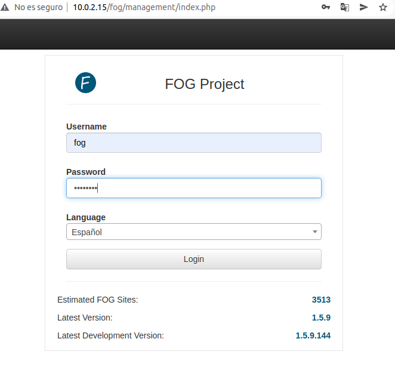
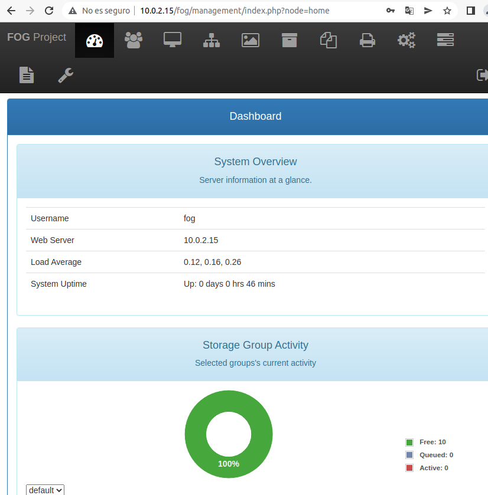
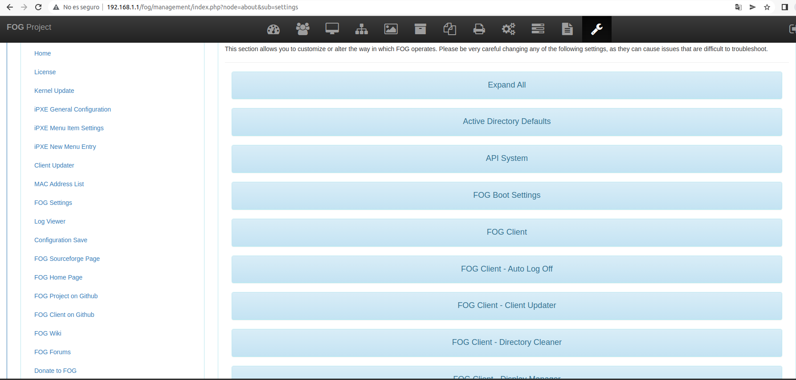
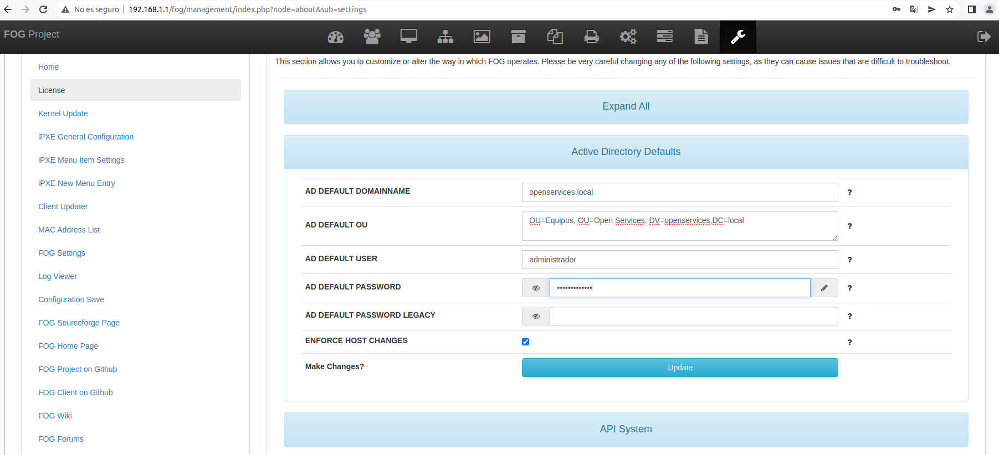
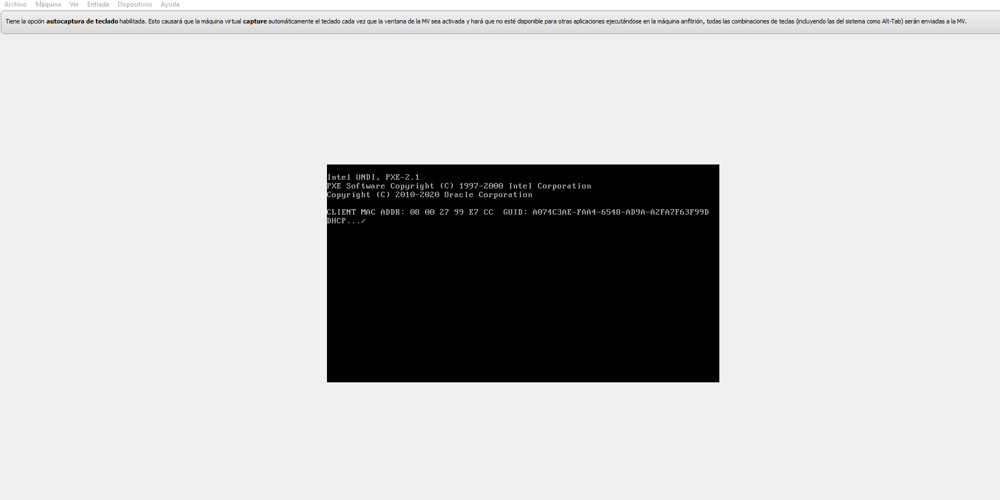
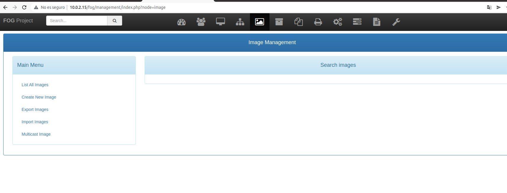
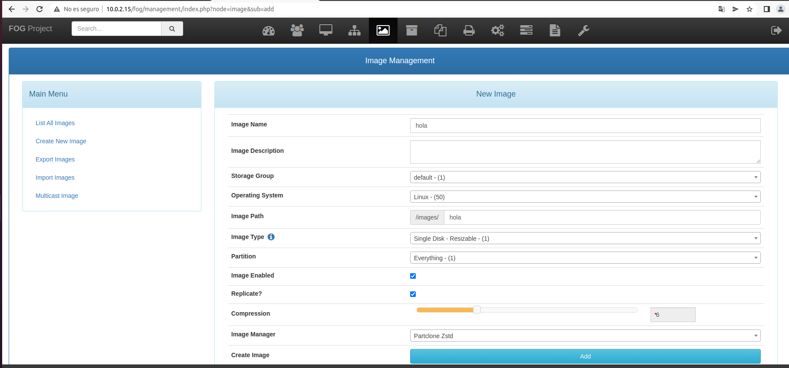
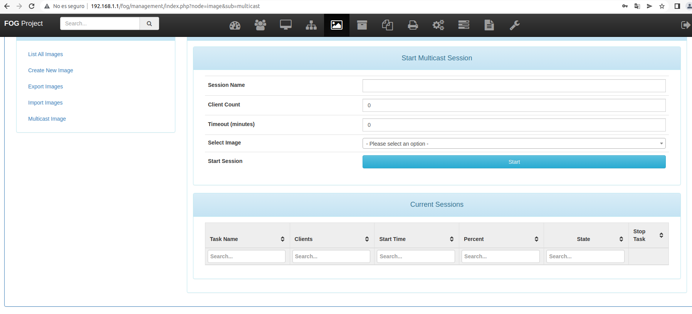

# 1. Pr6.2ClonacionconFOGProject

- [1. Pr6.2ClonacionconFOGProject](#1-pr62clonacionconfogproject)
  - [1.1. Configuracion de la maquina](#11-configuracion-de-la-maquina)
  - [1.2. Instalacion del flog](#12-instalacion-del-flog)
    - [1.2.1. Fallo el incapaz de solucionar](#121-fallo-el-incapaz-de-solucionar)
- [2. Intento de solucion](#2-intento-de-solucion)
- [3. Version En ubuntu 20.04](#3-version-en-ubuntu-2004)
- [4. Configuracion del Fog](#4-configuracion-del-fog)
- [5. Crear una Imagen.](#5-crear-una-imagen)
- [6. webgrafia](#6-webgrafia)

## 1.1. Configuracion de la maquina

Gran parte de la comfiguracion de esta maquin ya esta establecida anteriormente, la configuracion en este caso es configurar la ip de la maquina para que sea capaz de conectarse en la red que requerimos.

Para ello configuraremos la maquina añadiendole una direccion ip, o podemos modificar o establecer la maquina como adaptador puente esto nos permitira que la maquina pueda cojer la ip desde dhcp


## 1.2. Instalacion del flog

Aqui se debe exportar de git la aplicacion una vez exportada la aplicacion, nos pondremos a ejecutar la maquina el proceso para ejecutar el instalador debemos hacerlo con permisos de super usuario, tras ejecutarlo nos preguntara que version de linux queremos instalar.

Si le damos al 1 instaleremos con base a RedHat, en caso de darle al 2 es la version mas comun de linux ya que esta engloba tanto ubuntu como debian y es la opcion que elegiremos , en el caso de darle al 3 se engloban todos los demas extensiones de linux los comandos usados en esta parte es:
```
git clone https://github.com/FOGProject/fogproject.git
cd fogproject/bin
./installfog.sh

 ``` 


En este caso el ayuda del instalador nos guiara para la instalacion y confuguracion del instalador, esta parte nos preguntara si queremos una version developer es decir una version de prueba, en nuestro caso le daremos que no ya que queremos usas la version mas optima y completa posible.


Esta parte nos permite configurar y confirmas las opciones de red tanto la confirguracion del dhcp y del dns para poder conectar el servio a la red y permitir que esta se pueda ejecutar desde la red y nos permitira ejecutar el servicio desde una apliacion web y gestionar todo desde hay


Nos preguntara cierta informacion de la maquina nombre del servidor y forma de conectar esta nos permitira mediante un servicio de DNS poder conectar la maquina sin necesidad de saber la direccion ip del servidor, esto nos facilitaria el trabajo a la hora de gestionar la maquina y el proceso de clonado, tras la confirmacion y verificacion de la maquina, nos mostrara un resumen de la informacion que hemos introducido y de la maquina.

Tras eso se nos cargara e instalara mysql, php y otros servicios necesarios para ejecutar la aplicacion de y su correcto funcionamiento.


Tras la instalacion nos aparecera una url que en mi caso era `http://192.168.1.1/fog/management ` esta nos mostrara una pagina donde se nos requerira exporta una base de datos nos mostrata un comando, para hacerlo a mano o podemos ejecutarlo desde hay con un siguiente opcion que nos permitira el control y empezar a usarlo de manera normal.


### 1.2.1. Fallo el incapaz de solucionar

Tras el anterior paso no pude seguir, ya que me salio un error de PHP y de mysql el error es php-mysql este error ya no me volvio a salir pero directamente ya no me dejaba ejecutar la pagina intente buscarle alguna solucion pero no encontre una forma posible de hacela con la version de debian que se me a dado, ya que parece que la version actualizada de mi debian no es conpatible con la version de php-mysql no fui capaz de resolver el fallo por mi cuenta. 

# 2. Intento de solucion 

Tras el fallo opte por buscar alguna forma la forma que me salio mejor, fue buscar una version de ubuntu que fuera mejor, opte por la version de ubuntu 20.04, ya que es la version que mejor va y la mas estable esta se puede descargar tanto en version servert como en version desktop.

# 3. Version En ubuntu 20.04

Con esta version los pasos anteriores funciono perfectamente sin darme ningun problema a excepcion de un fallo de php-gettext (`https://zoomadmin.com/HowToInstall/UbuntuPackage/php-gettext`) para eso, y conseguir instalarlo a mono me meti en la pagina anteriormente mencionada. Gracias a eso me permitio instalar correctamente la apliacion.



Una vez dentro nos saldra las opciones. Esta nos mostrara el tipo de uso la cantidad de espacio utilizado, el tiempo de uso la dirrecion mac asignada atravez de la maquina lo cual se debera cambiar para su correcto funcionamento, ya que se debe usar un servico DHCP para que la aplicacion haga correcta la coneccion correctamente.



Tras entras debomos crear una imagen del lo que deseemos realizar para ellos debomos crear una copia de seguridad del dispositio en mi caso mi dhcp rechazaba la solicitud de las maquina para acceder a la ip dinamica lo cual me impido generar una copia de seguirar remota y tuve que realizar una copia local del sistema.

# 4. Configuracion del Fog

Para el correcto funcionanmento del fog, debemos configurarlo con algunos paramentros especifico, para ello accederemos a ajuste de fog y action defaults, estas opciones no permitia que no cualquiera puede entrar ya que el usuario primero el defecto y cualquier persona podria entrar,



Aqui se encutra la configuracion de los datos requerido, como se puede ver la configuracion de la red fue cambiando para un intentar que las maquinas sean capaces de encontrarse entre ellas.



Para el funcionamente desde el clientes debes configurar la ip para que sea capa de acceder y localizar la dhcp de la maquina arracando mediante red. Este paso no me dejo ta que mi equipo no era capaz de conseguir la direccion DHCP de mi ruto a pesar de que las maquina esta conecta de manera punte me resulto imposible.



# 5. Crear una Imagen.



Aqui intente configura la copia de seguridad con los parametros requerido para su correcto funcionamnete.



En este lugar se puede encontrar la informacion para logar conectar los clientes en el servidor fog y realizar una copia o hacer una copia tanto para un ordenador como para varios a la vez desde la red, sin necesidad de ir uno por uno.


# 6. webgrafia

https://comoinstalar.me/como-instalar-ubuntu-server-20-04-lts-focal-fossa-en-virtualbox/

https://www.youtube.com/watch?v=fUjlmyBQm7o

https://blog.redigit.es/fog-project-tareas-reportes-y-configuracion-del-servidor-fog-parte-iv/

http://wiki.serglobin.es/index.php?title=Servidor_fog&action=edit

https://www.youtube.com/watch?v=rge9_wKc01c

https://blog.redigit.es/fog-project-instalacion-ventajas-y-desventajas/