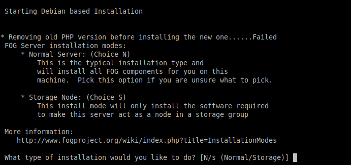

# 1. Pr6.2ClonacionconFOGProject

- [1. Pr6.2ClonacionconFOGProject](#1-pr62clonacionconfogproject)
  - [1.1. Configuracion de la maquina](#11-configuracion-de-la-maquina)
  - [1.2. Instalacion del flog](#12-instalacion-del-flog)
    - [1.2.1. Fallo el incapaz de solucionar](#121-fallo-el-incapaz-de-solucionar)

## 1.1. Configuracion de la maquina

Gran parte de la comfiguracion de esta maquin ya esta establecida anteriormente, la configuracion en este caso es configurar la ip de la maquina para que sea capaz de conectarse en la red que requerimos.

Para ello configuraremos la maquina añadiendole una direccion ip, o podemos modificar o establecer la maquina como adaptador puente esto nos permitira que la maquina pueda cojer la ip desde dhcp


## 1.2. Instalacion del flog

Aqui se debe exportar de git la aplicacion una vez exportada la aplicacion, nos pondremos a ejecutar la maquina el proceso para ejecutar el instalador debemos hacerlo con permisos de super usuario, tras ejecutarlo nos preguntara que version de linux queremos instalar.

Si le damos al 1 instaleremos con base a RedHat, en caso de darle al 2 es la version mas comun de linux ya que esta engloba tanto ubuntu como debian y es la opcion que elegiremos , en el caso de darle al 3 se engloban todos los demas extensiones de linux los comandos usados en esta parte es:
```
git clone https://github.com/FOGProject/fogproject.git
cd fogproject/bin
./installfog.sh

 ``` 


En este caso el ayuda del instalador nos guiara para la instalacion y confuguracion del instalador, esta parte nos preguntara si queremos una version developer es decir una version de prueba, en nuestro caso le daremos que no ya que queremos usas la version mas optima y completa posible.



Esta parte nos permite configurar y confirmas las opciones de red tanto la confirguracion del dhcp y del dns para poder conectar el servio a la red y permitir que esta se pueda ejecutar desde la red y nos permitira ejecutar el servicio desde una apliacion web y gestionar todo desde hay


Nos preguntara cierta informacion de la maquina nombre del servidor y forma de conectar esta nos permitira mediante un servicio de DNS poder conectar la maquina sin necesidad de saber la direccion ip del servidor, esto nos facilitaria el trabajo a la hora de gestionar la maquina y el proceso de clonado, tras la confirmacion y verificacion de la maquina, nos mostrara un resumen de la informacion que hemos introducido y de la maquina.

Tras eso se nos cargara e instalara mysql, php y otros servicios necesarios para ejecutar la aplicacion de y su correcto funcionamiento.


Tras la instalacion nos aparecera una url que en mi caso era `http://192.168.1.1/fog/management ` esta nos mostrara una pagina donde se nos requerira exporta una base de datos nos mostrata un comando, para hacerlo a mano o podemos ejecutarlo desde hay con un siguiente opcion que nos permitira el control y empezar a usarlo de manera normal.


### 1.2.1. Fallo el incapaz de solucionar

Tras el anterior paso no pude seguir, ya que me salio un error de PHP y de mysql el error es php-mysql este error ya no me volvio a salir pero directamente ya no me dejaba ejecutar la pagina intente buscarle alguna solucion pero no encontre una forma posible de hacela con la version de debian que se me a dado, ya que parece que la version actualizada de mi debian no es conpatible con la version de php-mysql no fui capaz de resolver el fallo por mi cuenta. 